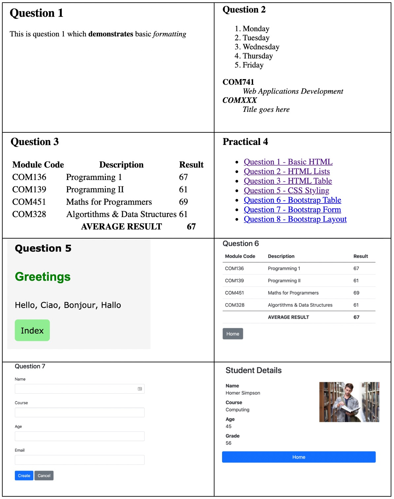

# COM741 Web Applications Development

## Practical 3 HTML/CSS

This practical will be completed via the Practical-3 project in **replit** 

To run the project click the run button, then in the browser window that opens up within repl copy the url to a new browser window and append the name of the html page to be viewed e.g. /q1.html 

### HTML

1. Complete ```q1.html``` by adding  
   
   * A Heading level 2 in bold containing text “Question 1”
   
   * A paragraph containing text below with formatting shown 
     
       “This is question 1 which **demonstrates** basic *formatting*”

2. Complete ```q2.html``` by adding
   
   * A Numbered list (```<ol> <li>```) containing the 5 days of the working week Monday-Friday
   * A description list (```<dl> <dd> and <dt>```) containing the modules you have completed this year. Use the module code as the title and module description as the text. You should bold the titles and emphasise the text.  

3. Complete ```q3.html``` by adding a table containing the following header, body and footer data
   
   | Code   | Description.   | Result |
   | ------ | -------------- | ------ |
   | COM136 | Programming 1  | 67     |
   | COM139 | Programming 2  | 61     |
   | COM451 | Maths 1        | 69     |
   | COM328 | Algorithms     | 71     |
   |        | AVERAGE RESULT | 67     |

4. Amend the existing ```index.html``` file, setting the document title to 'Practical 3' and add a level 2 heading containing text “Practical 3 Questions”. Then add HTML anchor tag links to each of the pages used to answer questions 1-3 inside an unordered list. Ensure all questions completed from this point on also have a link in this page. 

 ### CSS

5. Complete ```q5.html``` by amending the ```<style>``` section as follows
   
   * Style the ```<body>``` tag to (i) set the background colour to whitesmoke, (ii.) the body font-family and size to Verdana 2em, (iii.) with a margin around the body of 2em.
   
   * Create a custom style named ```custom``` setting font, font size and colour to values of your choice, then apply the style to the ```<h3>``` tag.
     
     **OPTIONAL**
   
   * Create a custom style called ```anchor``` that when applied to the ```<a>``` tag will make it look like a button with a hover style. The styles should include (i.) background color of lightgreen, (ii.) text color of black, (iii.) border radius of 6px, (iv.) border style of none, (v.) font size of 1em, (vi.) padding of 0.75em, (vii.) no outline. 
   
   * Add an anchor hover pseudo style ```.anchor:hover { ...}``` that will automatically change the button style when it is hovered over. The styles should include (i.) change cursor to a pointer style, (ii.) set background color to green, (iii.) set text color white.
     
     ***Feel free to try out your own designs for the anchor style***

 ### Bootstrap

6. Complete ```q6.html``` by
   
   * Copy the table created in q3 and apply appropriate bootstrap table styling. Try out the various table styles provided.
   * Add a link to the page which links to the index.html page. Style the link using a suitable bootstrap button style e.g. "secondary"

7. Complete ```q7.html``` by creating a form (applying relevant bootstrap styling) to collect data to create a new student (input field types are text for name and course, number for age, email for the email address and url for the photo Url). Add a Save button (use primary style) and a link that takes you back to the index page (use a button style of secondary)
   
   ```
   Name        _____________
   Course      _____________
   Age         _____________
   Email       _____________
   PhotoUrl    _____________
   
   Save  Cancel
   ```

8. Complete ```q8.html``` by creating a bootstrap **grid layout** containing
   
   * A level 2 heading containing “Student Details”. Add margin top and bottom to leave some space above and below the heading. Try different bootstrap margins and see which looks best (e.g. mt-1 to mt-5 or mb-1 to mb-5)
   
   * A row containing 2 columns with width 2/3 and 1/3 respectively. Remember a row has 12 columns so setting first column to col-8 and the second to col-4 would be appropriate.
   
   * In the first column create a **description list** using (```<dl> <dd> and <dt>```) tags to include the following details 
     
     ```
     Name    Homer Simpson
     Course  Computing
     Age     45
     Grade   67
     ```
   
   * In the second column add an image tag with a class style of ```img-fluid``` and the following url ```https://www.uos.ac.uk/sites/www.uos.ac.uk/files/student-3500990_1920.jpg```
   
   * Create a second row (no columns needed) and add a link (styled as a primary button) that links back to the index page.
     
     *Resize the page and check that it displays a responsive layout with the elements automatically adjusting to fit the viewport.*


### Summary

If you have additional time then create another page q9.html and try out other HTML/CSS/Bootstrap examples. You will find lots of material on W3Schools (https:/www.w3schools.com) 

Note that question solutions 1-8 when viewed in the browser each question should look something like those contained in the image practical_3.jpg shown below

